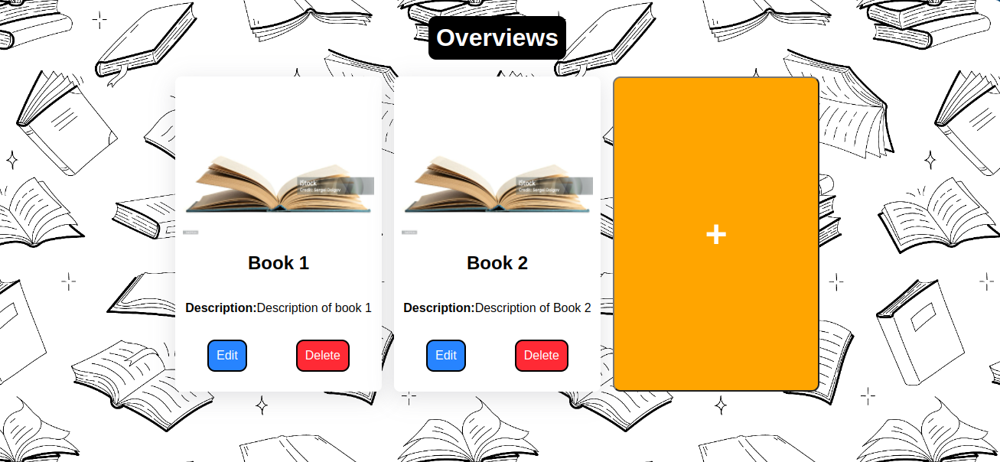
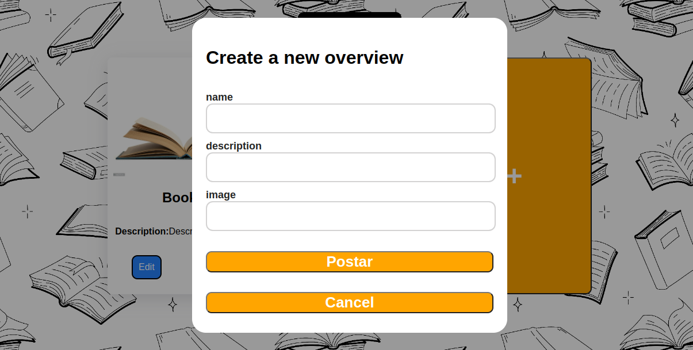
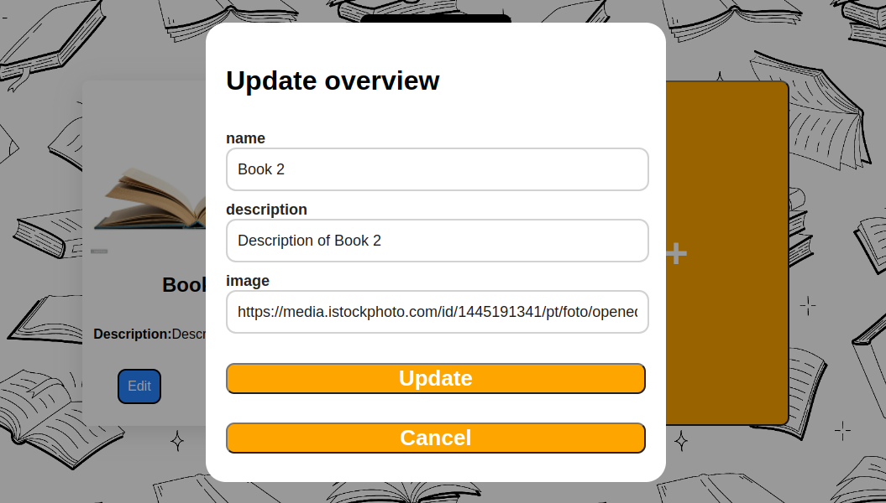
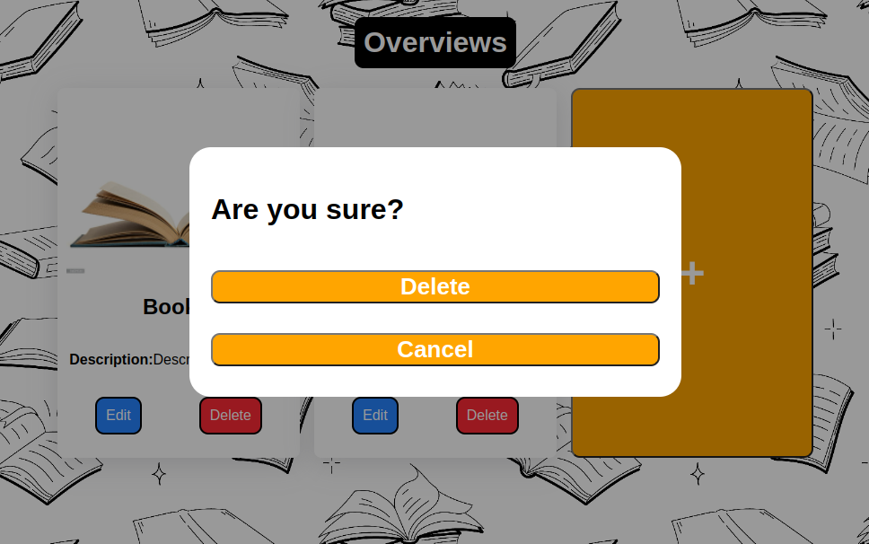

# Book Overviews

<p align="center">
    
</p>
<p align="center">
    
</p>
<p align="center">
    
</p>
<p align="center">
    
</p>

This project is an Overviews built using **ReactJs and Springboot**

## Installation

1. Clone the repository:

```bash
git clone https://github.com/thomasgsquinaia/books_overviews.git
```

2. Install the dependencies:

```bash
npm install
```

3. Run the project

```bash
npm run dev
```

## Clone the API repository:

Link repository: https://github.com/thomasgsquinaia/api_books_overviews

1. Clone the repository:

```bash
git clone https://github.com/thomasgsquinaia/api_books_overviews.git
```

2. Install dependencies with Maven

3. Install PostgresSQL

